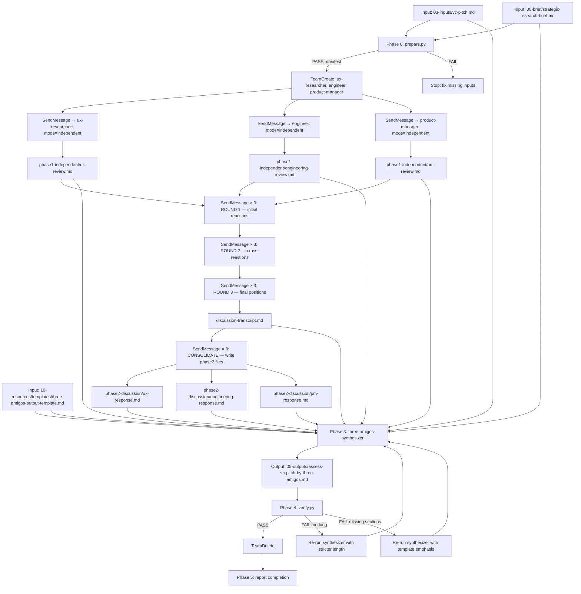

# Assess VC Pitch by Three Amigos: Workflow Map

## Automated Validations and Tests

### Phase 0 (`prepare.py`)

- Checks `03-inputs/vc-pitch.md` exists.
- Checks `00-brief/strategic-research-brief.md` exists.
- Creates:
  - `04-process/three-amigos-reviews/phase1-independent/`
  - `04-process/three-amigos-reviews/phase2-discussion/`
- Emits `FAIL` with issues list if required inputs are missing.

### Phase 4 (`verify.py`) on final output

- Output file exists.
- Word count is between `500` and `2500`.
- Required sections exist:
  - `## Executive Summary`
  - `## Desirability Assessment`
  - `## Feasibility Assessment`
  - `## Viability Assessment`
  - `## Cross-Cutting Tensions`
  - `## Consensus Recommendations`
- Consensus recommendations count is `<= 5`.
- Emits JSON report with:
  - `status`
  - `word_count`
  - `max_words`
  - `page_estimate`
  - `issues`

## Orchestrator Gate Checks

- All 3 Phase 1 files exist in `phase1_folder`.
- Discussion transcript exists with Rounds 1, 2, and 3.
- All 3 Phase 2 files exist in `phase2_folder`.
- Re-run only failed reviewer agents in Phase 1.
- Re-run only failed SendMessage calls in Phase 2 rounds.
